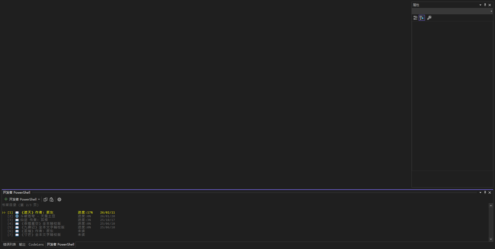
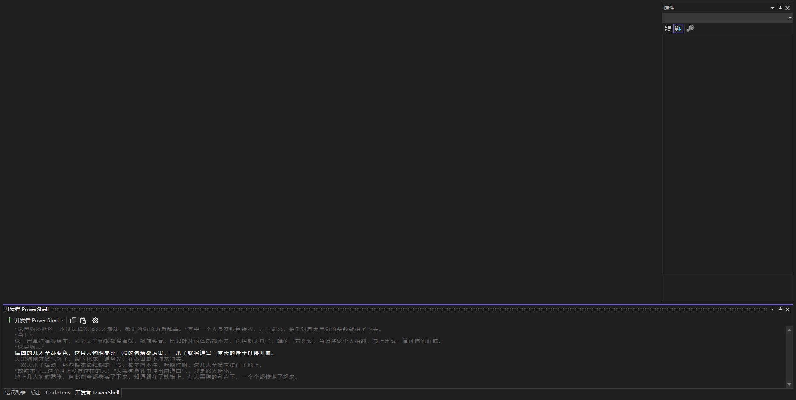

# Moyu Novel Reader

Moyu is a local novel reader built with C# (.NET Framework 4.8). It supports TXT and EPUB files, featuring bookshelf management, progress saving, chapter navigation, and auto-reading. It is designed for use in the Windows console environment.

## Key Features

- Supports importing and reading novels in TXT and EPUB formats
- Paginated bookshelf browsing with keyboard shortcuts
- Automatic progress saving and chapter navigation
- Auto-reading and auto read-aloud modes (adjustable speed, toggle/pause on demand)
- Boss Key (hides the interface)
- Supports environment variable configuration for quick command-line launching
- Clean console interface adapted for Chinese and full-width character display widths
- Toggleable on-screen instructions

## Quick Start

### Requirements

- Windows OS
- .NET Framework 4.8
- Visual Studio 2022 or higher

### Build and Run

1. Open the project solution in Visual Studio.
2. Restore dependencies and build the project.
3. Run the `Moyu` console application.

### Add Novels

- After launching, press `O`, enter the full path to a TXT or EPUB file/folder, and the novels will be imported.
- Supports batch importing all TXT/EPUB files within a folder.

## Key Operations

- `↑/W` `↓/S`: Select book
- `Enter`: Open selected book to read
- `←/A` `→/D`: Paginate through the bookshelf or turn pages while reading
- `O`: Add novels
- `Delete`: Delete selected novel
- `P`: Configure environment variables
- `H`: Toggle instructions
- `T`: Select chapter while reading
- `Space`: Toggle auto-reading mode while reading (press again to exit auto-reading)
- `R`: Toggle auto read-aloud mode while reading
- `+/-`: Adjust speed during auto-reading
- `ESC`: Go back or exit
- `.` or `` ` ``: Boss key to hide interface

## Advanced Notes

- Supports width adaptation for Chinese and full-width characters
- Read progress and bookshelf information are automatically persisted
- The Boss key quickly hides the interface, making it suitable for office environments
- Auto-reading can be toggled at any time with adjustable speed
- **After setting environment variables, it can be conveniently launched from the VS terminal**

## License

This project is for learning and exchange purposes only.
